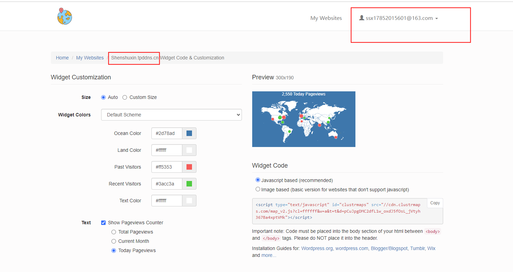

https://clustrmaps.com/

统计指定网站的访问人数，访问位置，服务端是clustrmaps网站，免费注册一个账号，登录上面的网站，获取js代码嵌入自己的网站就可以统计了


```
1. 展示全部访问
<script type='text/javascript' id='clustrmaps' src='//cdn.clustrmaps.com/map_v2.js?cl=ffffff&w=a&t=tt&d=pCuJpgDMC2dfL1w_oxdJ5fOsL_jVtyh367Ba4xptVMk'></script>

2. 本月
<script type='text/javascript' id='clustrmaps' src='//cdn.clustrmaps.com/map_v2.js?cl=ffffff&w=a&t=m&d=pCuJpgDMC2dfL1w_oxdJ5fOsL_jVtyh367Ba4xptVMk'></script>

3. 今天
<script type='text/javascript' id='clustrmaps' src='//cdn.clustrmaps.com/map_v2.js?cl=ffffff&w=a&t=t&d=pCuJpgDMC2dfL1w_oxdJ5fOsL_jVtyh367Ba4xptVMk'></script>

```
