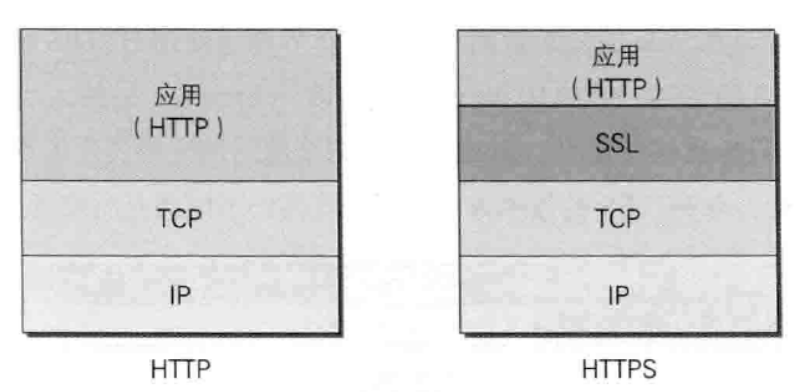
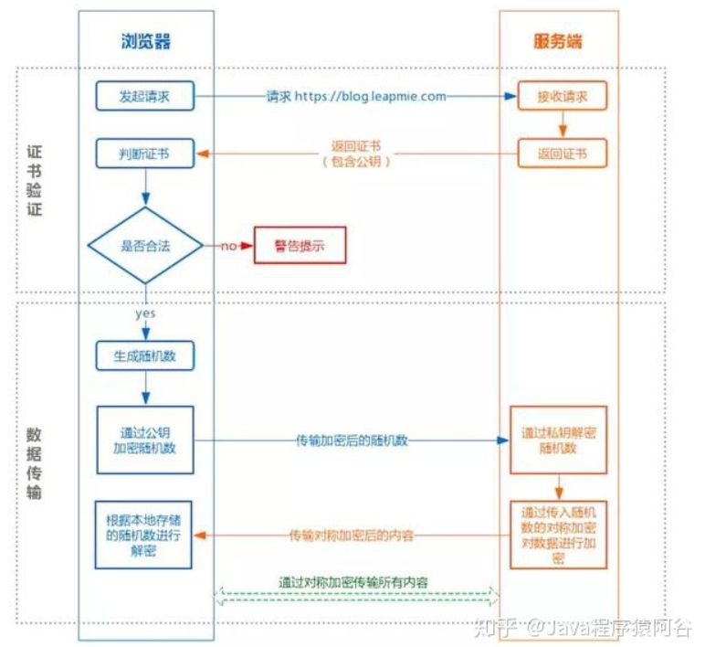

HTTPS：简单讲是HTTP的安全版，在HTTP下加入SSL层，HTTPS的安全基础是SSL，因此加密的详细内容就需要SSL。


证书: 认证机构(CA)信息,公钥,域名,有效期,指纹(对证书进行hash运算,即证书摘要),指纹算法,数字签名(CA私钥加密的指纹)等

# 请求流程

## 验证过程:
1. 证书是否过期
2. CA是否可靠(查询信任的本地根证书)
3. 证书是否被篡改(用户使用CA根公钥解密签名得到原始指纹,再对证书使用指纹算法得到新指纹,两指纹若不一样,则被篡改)
4. 服务器域名和证书上的域名是否匹配

## 通信过程-简单: 
1. 客户端发起 HTTPS 请求,服务端返回证书
2. 客户端对证书进行验证,验证通过后本地生成用于改造对称加密算法的随机数。
3. 通过证书中的公钥对随机数进行加密传输到服务端，服务端接收后通过私钥解密得到随机数，之后的数据交互通过对称加密算法进行加解密。

## 通信过程如下-详细
1、客户端和服务器端通过TCP建立连接，并发送https请求。

2、服务器响应请求，并将数字证书发送给客户端，数字证书包括公共秘钥、域名、申请证书的公司。

3、客户端收到服务器端的数字证书之后，会验证数字证书的合法性。

4、如果公钥合格，那么客户端会生成client key，一个用于进行对称加密的密钥，并用服务器的公钥对客户端密钥进行非对称加密。

5、客户端会再次发起请求，将加密之后的客户端密钥发送给服务器。

6、服务器接收密文后，会用私钥对其进行非对称解密，得到客户端秘钥。并使用客户端秘钥进行对称加密，生成密文并发送。

7、客户端收到密文，并使用客户端秘钥进行解密，获取数据。

# nginx部署
1. 下载安装包`http://nginx.org/en/download.html`
2. 解压`tar -zxvf nginx-1.20.2.tar.gz`
3. 安装 nginx 的相关依赖`yum -y install gcc zlib zlib-devel pcre-devel openssl openssl-devel`
4. 生成 Makefile`./configure --with-http_ssl_module`
5. 编译`make`
6. 安装`make install`
7. 删除解压的文件夹（第二步的），编译后此文件就不用了
7. 进入`/usr/local/nginx/sbin`运行

# nginx完全指南


# acmesh方式部署https
## 1. 前提条件
- acmesh官网：https://github.com/acmesh-official/acme.sh/wiki/%E8%AF%B4%E6%98%8E
- 已有http网站并且是nginx部署的

## 2. 原理
先验证域名的所有权，验证成功之后直接安装证书。

## 3. 因为官网有中文的安装文档，下面是记录具体的执行步骤
```sh
cd apps/acmesh

# 下载安装
curl https://get.acme.sh | sh -s email=ssx17852015601@163.com
# 成功会打印 [Fri Mar 31 10:26:32 CST 2023] Install success!

cd ~/.acme.sh/

alias acme.sh=~/.acme.sh/acme.sh

#配置下nginx的环境变量 vim ~/.bash_profile +$PATH

# 认证域名所有权
acme.sh --issue -d shenshuxin.tpddns.cn --nginx /usr/local/nginx/conf/nginx.conf

# 下发证书 安装 证书
acme.sh --install-cert -d example.com \
--key-file       /path/to/keyfile/in/nginx/key.pem  \
--fullchain-file /path/to/fullchain/nginx/cert.pem \
--reloadcmd     "service nginx force-reload"
```
## 4. 遇到的问题
1. 因为我的ip不支持80、443端口访问，所以验证整数的时候不行，因为验证证书仅仅支持80端口
2. 验证域名的所有权可以http方式可以dns方式，因为http我没有80端口号，但是dns方式我的域名是腾达路由器的免费二级域名，也不支持dns添加txt。所以不能进行域名所有权验证。
3. 解决方案可以给宽带客服打电话开通80端口访问 或者使用花生壳域名支持添加dns的txt

## 购买阿里云域名，然后通过dns解析认证并注册域名
[参考网址](https://blog.csdn.net/yedajiang44/article/details/121173526)

1. 购买网址： https://home.console.aliyun.com/home/dashboard/ProductAndService
2. 设置dns解析为自己的公网ip
  - 新增阿里访问控制配置权限并且添加到本地环境变量
    export Ali_Key="xxx"
    export Ali_Secret="xxxxx"

3. 使用acme.sh认证域名所有权 
`acme.sh --force --issue --dns dns_ali -d shenshuxin.cn -d *.shenshuxin.cn --yes-I-know-dns-manual-mode-enough-go-ahead-please`

成功后
 Your cert is in: /home/ssx/.acme.sh/shenshuxin.cn/shenshuxin.cn.cer
 Your cert key is in: /home/ssx/.acme.sh/shenshuxin.cn/shenshuxin.cn.key
后续步骤忽略

4. 把生成的TXT记录添加到阿里云域名DNS解析中
5. 再次认证
`acme.sh --renew  -d shenshuxin.cn --yes-I-know-dns-manual-mode-enough-go-ahead-please`

6. 生成密钥文件
```sh
acme.sh --install-cert -d  shenshuxin.cn  \
--key-file       /home/ssx/apps/subacme/key.pem  \
--fullchain-file /home/ssx/apps/subacme/cert.pem 
```

7. nginx配置
```sh
listen 443 ssl;
server_name www.shenshuxin.cn;
ssl_certificate /etc/nginx/conf.d/acme/cert.pem;
ssl_certificate_key /etc/nginx/conf.d/acme/key.pem;
```
---

# nginx功能
1. 限制连接数：可以限制每个ip最大连接数
2. 限制请求数：每个ip最大请求数
3. 限制带宽：最大下载速度
4. 静态文件缓存


# nginx转发
```sh
location /gateway/ {
    proxy_pass http://node101:30501;
    rewrite "^/gateway/(.*)$" /$1 break;
}
```

# nginx配置401错误重定向
1. 代码
error_page 401 =301 http://shenshuxin.tpddns.cn:10?rewriteUrl=${http_host}${request_uri};
2. 结果
http://shenshuxin.tpddns.cn:10?rewriteUrl=shenshuxin.tpddns.cn:81/?aaaaa=1234


