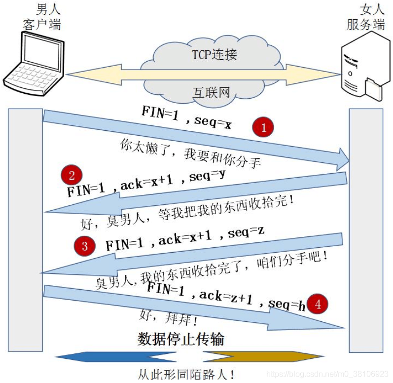

# TCP三次握手
TCP头部结构，如下
.jpg)

三次握手的过程是：
- 第一次握手：client SYN=1, Sequence number=2322326583（生成随机数） —> server
- 第二次握手：server SYN=1,Sequence number=3573692787（生成随机数）; ACK=1, Acknowledgment number=2322326583 + 1 —> client
- 第三次握手：client ACK=1, Acknowledgment number=3573692787 + 1 -->server
.jpg)

# TCP四次挥手
第1次挥手：客户端发送一个FIN，用来关闭客户端到服务端的数据传送，客户端进入FIN_WAIT_1状态；

第2次挥手：服务端收到FIN后，发送一个ACK给客户端，确认序号为收到序号+1（与SYN相同，一个FIN占用一个序号），服务端进入CLOSE_WAIT状态；

第3次挥手：服务端发送一个FIN，用来关闭服务端到客户端的数据传送，服务端进入LAST_ACK状态；

第4次挥手：客户端收到FIN后，客户端t进入TIME_WAIT状态，接着发送一个ACK给Server，确认序号为收到序号+1，服务端进入CLOSED状态，完成四次挥手。

其中：FIN标志位数置1，表示断开TCP连接。
