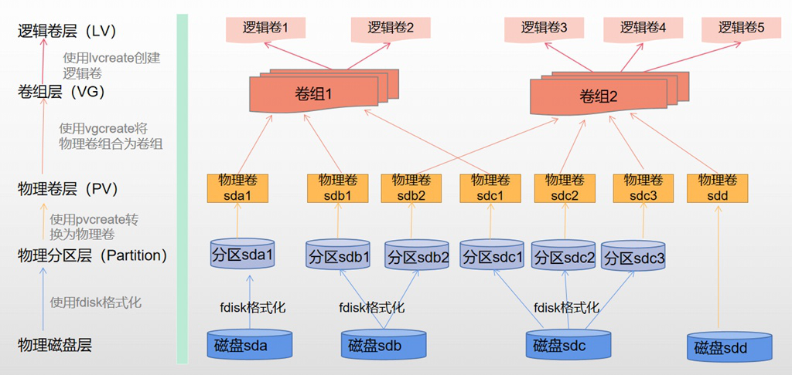

1. yum常用命令
- 更新库 yum update
- 配置阿里镜像 
 - cd /etc/yum.repos.d
 - wget http://mirrors.aliyun.com/repo/Centos-7.repo
 - mv Centos-7.repo CentOS-Base.repo
 - yum clean all
 - yum makecache
 - yum update -y

2. 磁盘分区逻辑卷

## 查询磁盘信息
`df`命令
检测到的第一个硬盘名为/dev/sda。
检测到的第二块硬盘命名为/dev/sdb，以此类推。

## 查询磁盘分区
`fdisk -l`命令
/dev/sda1
/dev/sda2
表示sda硬盘有两个分区

## 查询物理卷
pvs

## 查询卷组
vgs 

## 查询逻辑卷
lvs

## 挂载逻辑卷
mount /dev/卷组名/逻辑卷名 /targetPath

## 为什么要使用逻辑卷
对于物理磁盘，我们直接分区、格式化为文件系统之后就可以使用，那为什么还需要使用逻辑卷的方式来管理磁盘呢？我认为主要有2个原因：
- 业务上使用大容量的磁盘。举个例子，我们需要在/data下挂载30TB的存储，对于单个磁盘，是无法满足要求的，因为市面上没有那么大的单块磁盘。但是如果我们使用逻辑卷，将多个小容量的磁盘聚合为一个大的逻辑磁盘，就能满足需求。
- 扩展和收缩磁盘。在业务初期规划磁盘时，我们并不能完全知道需要分配多少磁盘空间是合理的，如果使用物理卷，后期无法扩展和收缩，如果使用逻辑卷，可以根据后期的需求量，手动扩展或收缩。

## 设备映射dm-x
Device Mapper 是 Linux 2.6 内核中提供的一种从逻辑设备到物理设备的映射框架机制，

[root@ht8 sd_mod]# ll /dev/dm*
brw-rw---- 1 root disk 253, 0 Jan 5 19:39 /dev/dm-0
brw-rw---- 1 root disk 253, 1 Jan 5 19:39 /dev/dm-1

[root@ht8 sd_mod]# ll /dev/mapper
total 0
lrwxrwxrwx 1 root root 7 Jan 5 19:39 centos-root -> ../dm-0
lrwxrwxrwx 1 root root 7 Jan 5 19:39 centos-swap -> ../dm-1

