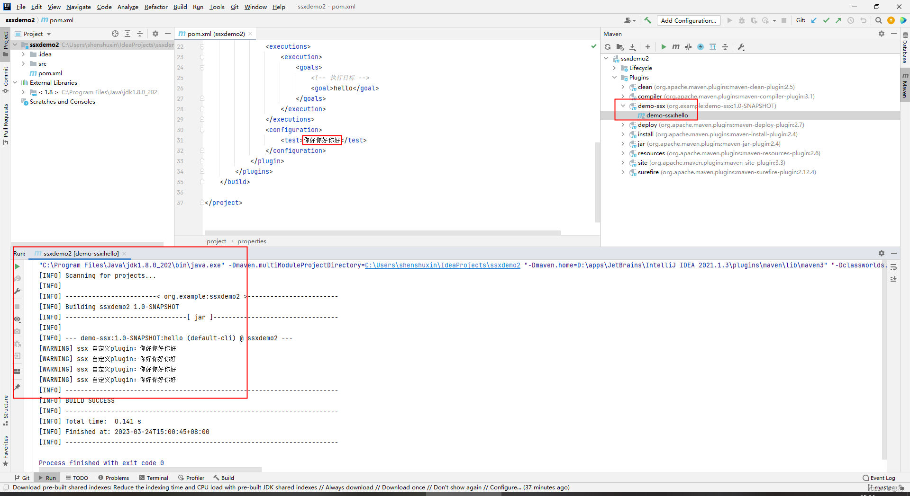
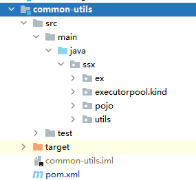
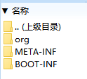
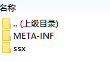

# profiles
maven配置文件的profiles功能类似于springboot的`spring.profiles.active`配置，指定不同的环境来读取相应的配置内容。
`<profiles>`标签的子标签可以包含`<repository>` `<plugin>` `<dependencies>` `<distributionManagement>`等。

触发激活配置可以是:
- 命令行 `mvn -p prod xxx `
- 默认配置 `<activeByDefault>true</activeByDefault>`

详情查看[csdn文章](https://blog.csdn.net/zy103118/article/details/79879879?spm=1001.2014.3001.5506)

---


# 自定义maven插件plugin
1. 创建maven项目
2. pom文件设置：
 -  ```xml
    <artifactId>demo-ssx</artifactId>
    <packaging>maven-plugin</packaging>
    <dependencies>
        <dependency>
            <groupId>org.apache.maven</groupId>
            <artifactId>maven-plugin-api</artifactId>
            <version>2.0</version>
        </dependency>
        <dependency>
            <groupId>org.apache.maven.plugin-tools</groupId>
            <artifactId>maven-plugin-annotations</artifactId>
            <version>3.1</version>
        </dependency>
    </dependencies>
    ```
3. 继承`Mojo`插件的抽象类实现方法
    ```java
    package ssx;

    import org.apache.maven.plugin.AbstractMojo;
    import org.apache.maven.plugin.MojoExecutionException;
    import org.apache.maven.plugin.MojoFailureException;
    import org.apache.maven.plugins.annotations.LifecyclePhase;
    import org.apache.maven.plugins.annotations.Mojo;
    import org.apache.maven.plugins.annotations.Parameter;

    @Mojo(name="hello",defaultPhase = LifecyclePhase.CLEAN)
    public class SsxMojo extends AbstractMojo {
        @Parameter
        private String test;
        //真正执行的方法
        @Override
        public void execute() throws MojoExecutionException, MojoFailureException {
            getLog().warn("ssx 自定义plugin："+test);
            getLog().warn("ssx 自定义plugin："+test);
            getLog().warn("ssx 自定义plugin："+test);
            getLog().warn("ssx 自定义plugin："+test);
        }
    }
    ```
4. 把此工程打包发布
`mvn install deploy`
5. 使用
在另一个工程中pom文件引入此plugin
    ```xml
    <plugins>
        <plugin>
            <groupId>org.example</groupId>
            <artifactId>demo-ssx</artifactId>
            <version>1.0-SNAPSHOT</version>
            <executions>
                <execution>
                    <goals>
                        <goal>hello</goal>
                    </goals>
                </execution>
            </executions>
            <configuration>
                <test>你好你好你好</test>
            </configuration>
        </plugin>
    </plugins>
    ```
    执行命令`mvn demo-ssx:hello`或者idea中右侧maven的plugin选项
    

6. 源码github参考 
[https://github.com/shenshuxin01/maven_diy_plugin/tree/master](https://github.com/shenshuxin01/maven_diy_plugin/tree/master)


# maven下载依赖指定仓库地址
```xml
<repositories>
    <repository>
        <id>alibaba-public</id>
        <url>https://maven.aliyun.com/repository/public</url>
    </repository>
    <repository>
        <id>maven-public</id>
        <url>http://192.168.192.129:8081/repository/maven-public/</url>
    </repository>
</repositories>
```
上面的机制就是先去阿里仓库下载，如果下载失败会去第二个配置仓库中下载。


# maven配置远程仓库mirror
1. 下载的maven软件目录下的settings.xml文件中的`<mrrrors>`标签是空的。
2. maven项目使用的仓库一共有如下几种方式：
    - 中央仓库，这是默认的仓库
    - 镜像仓库，通过 sttings.xml 中的 settings.mirrors.mirror 配置
    - 全局profile仓库，通过 settings.xml 中的 settings.repositories.repository 配置
    - 项目仓库，通过 pom.xml 中的 project.repositories.repository 配置
    - 项目profile仓库，通过 pom.xml 中的 project.profiles.profile.repositories.repository 配置
    - 本地仓库
3. 搜索顺序如下：
local_repo > settings_profile_repo > pom_profile_repo > pom_repositories > settings_mirror > central

## `<mrrrors>`标签使用
1. 当`<mrrrors>`标签没有配置，并且项目中的pom文件没有指定`<repository>`标签，那么项目的jar包会从`远程仓库id是central的地址：中央仓库，这是默认的仓库`下载https://repo.maven.apache.org/maven2/ ，maven内部默认指定了central仓库地址是https://repo.maven.apache.org/maven2/ 。也就是说这个默认的配置是兜底的

2. 当`<mrrrors>`标签配置如下，并且项目中的pom文件没有指定`<repository>`标签
    ```xml
    <mirror>
        <id>settingsMirrorAliyun</id>
        <mirrorOf>abc</mirrorOf>
        <name>阿里maven镜像</name>
        <url>https://maven.aliyun.com/nexus/content/repositories/central</url>
    </mirror>
    ```
    那么项目的jar包会从`远程仓库id是central的地址`下载https://repo.maven.apache.org/maven2/
    ，上面的配置表示如果请求的仓库id是abc,那么就使用这个阿里的地址下载，


3. 当`<mrrrors>`标签配置如下，并且项目中的pom文件没有指定`<repository>`标签
    ```xml
    <mirror>
        <id>settingsMirrorAliyun</id>
        <mirrorOf>central</mirrorOf>
        <name>阿里maven镜像</name>
        <url>https://maven.aliyun.com/nexus/content/repositories/central</url>
    </mirror>
    ```
    那么项目的jar包会从`远程仓库id是central的地址`下载https://maven.aliyun.com/nexus/content/repositories/central
，此时maven的中央仓库被镜像到了阿里


4. 当`<mrrrors>`标签配置如下
    ```xml
    <mirror>
        <id>settingsMirrorAliyun</id>
        <mirrorOf>abc</mirrorOf>
        <name>阿里maven镜像</name>
        <url>https://maven.aliyun.com/nexus/content/repositories/central</url>
    </mirror>
    ```
    并且项目中的pom文件指定`<repository>`标签
    ```xml
        <repository>
            <id>projectPomRepo</id>
            <name>项目指定远程仓库</name>
            <url>https://repo.maven.apache.org/maven2/</url>
        </repository>
    ```
    那么项目的jar包会从`远程仓库id是projectPomRepo的地址`下载https://repo.maven.apache.org/maven2/
，上面的配置表示如果请求的仓库id是abc,那么就使用这个阿里的地址下载，


5. 当`<mrrrors>`标签配置如下
    ```xml
    <mirror>
        <id>settingsMirrorAliyun</id>
        <mirrorOf>*</mirrorOf>
        <name>阿里maven镜像</name>
        <url>https://maven.aliyun.com/nexus/content/repositories/central</url>
    </mirror>
    ```
    并且项目中的pom文件指定`<repository>`标签
    ```xml
        <repository>
            <id>projectPomRepo</id>
            <name>项目指定远程仓库</name>
            <url>https://repo.maven.apache.org/maven2/</url>
        </repository>
    ```
    那么项目的jar包会从`远程仓库id是projectPomRepo的地址`下载https://maven.aliyun.com/nexus/content/repositories/central
，上面的配置表示如果请求的仓库id是任意的,那么就使用这个阿里的地址下载 

## 总结一下
当项目的pom文件没有指定`<repository>`标签的时候，项目的jar包都是默认在远程仓库id是central的地址下载，下载前需要看下有没有配置镜像，如果配置了并且仓库id匹配上，那么就在镜像地址下载。 其实上面如果配置` <mirrorOf>*</mirrorOf>`表示所有的远程仓库地址都被镜像到了阿里，如果阿里没有此jar包则会项目报错。建议的配置应该是` <mirrorOf>central</mirrorOf>`，这样的话如果阿里镜像没有的话，我们可以指定项目的`<repository>`标签指定下载地址，当然指定的仓库id不能再是central


# springboot项目默认打jar包后项目结构发生变化

## 默认的pom文件内容
```xml
<build>
    <plugins>
        <plugin>
            <groupId>org.springframework.boot</groupId>
            <artifactId>spring-boot-maven-plugin</artifactId>
        </plugin>
    </plugins>
</build>
```
使用`mvn package`后生成的jar结构内容如下：


这样看我的包名不见了,如果其他模块引用了这个包并且使用某个类就找不到了。
## 修改后的pom文件
```xml
<build>
    <plugins>
    </plugins>
</build>
```

这样就可以直接使用了