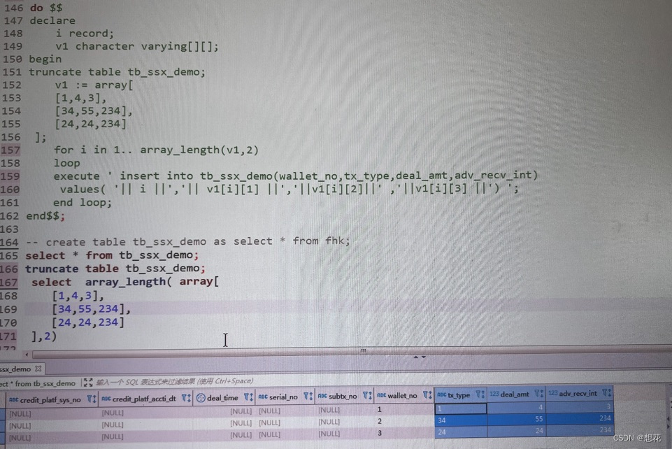

# SQL语法
[菜鸟教程sql](https://www.runoob.com/sql/sql-tutorial.html)

# sql优化
1. 创建合适的索引：普通的btree索引，唯一索引、位图索引（男女）、多列联合索引
2. 避免子查询
3. 复杂sql拆分成几个简单sql
4. 用union all代替union
5. 批量操作
6. in中值太多 使用exsits
7. like避免左模糊查询
8. 多多使用表连接 最好是内连接

# mysql too many connections 解决方法
```sql
-- 查看最大连接数
show variables like '%max_connections%';

-- 查看实时连接数
show global status like 'Max_used_connections';

-- 这个数值指的是mysql在关闭一个非交互的连接之前要等待的秒数
show global variables like 'wait_timeout'; 

-- 调试 避免too many connect
set GLOBAL max_connections=1000; 
set global wait_timeout=300; 
```

# postgres10版本，匿名函数+二维数组使用
    


# mysql正则过滤和substring_index

```sql
-- 截取字符串 最后一个参数是截取前几个
select substring_index('a6b6c6','6',2)
```
