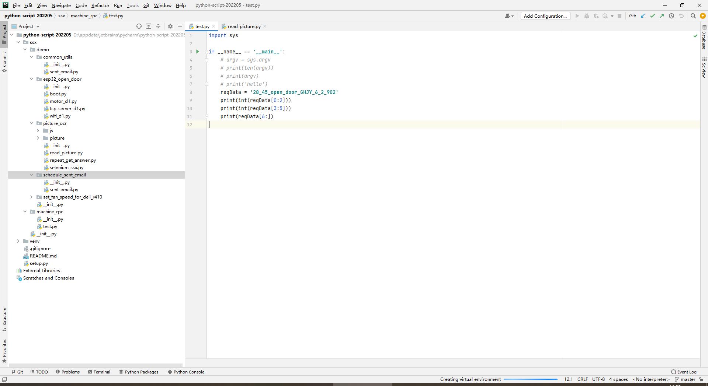

# 基础知识
[菜鸟教程python](https://www.runoob.com/python3/python3-tutorial.html)

# 自定义包setup
目的： 我创建了2个模块并且模块下有py文件，若一个模块下的py文件执行需要依赖另一个py文件下函数，我直接在pycharm可以运行，但是命令行报错：ModuleNotFoundError: No module named

项目打包的命令：
`python3 setup.py bdist_wheel`

执行命令后会在同级目录下生成dist build目录，进入dist下后执行：
`pip3 install --force-reinstall ssx-0.0.1-py3-none-any.whl`

# 应用项目2022
[gitee](https://gitee.com/shenshuxin01/python-script-202205)

# pip3使用安装python3的依赖
`pip3 install requests`
