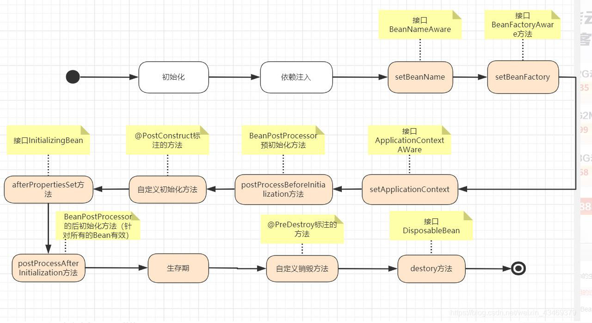
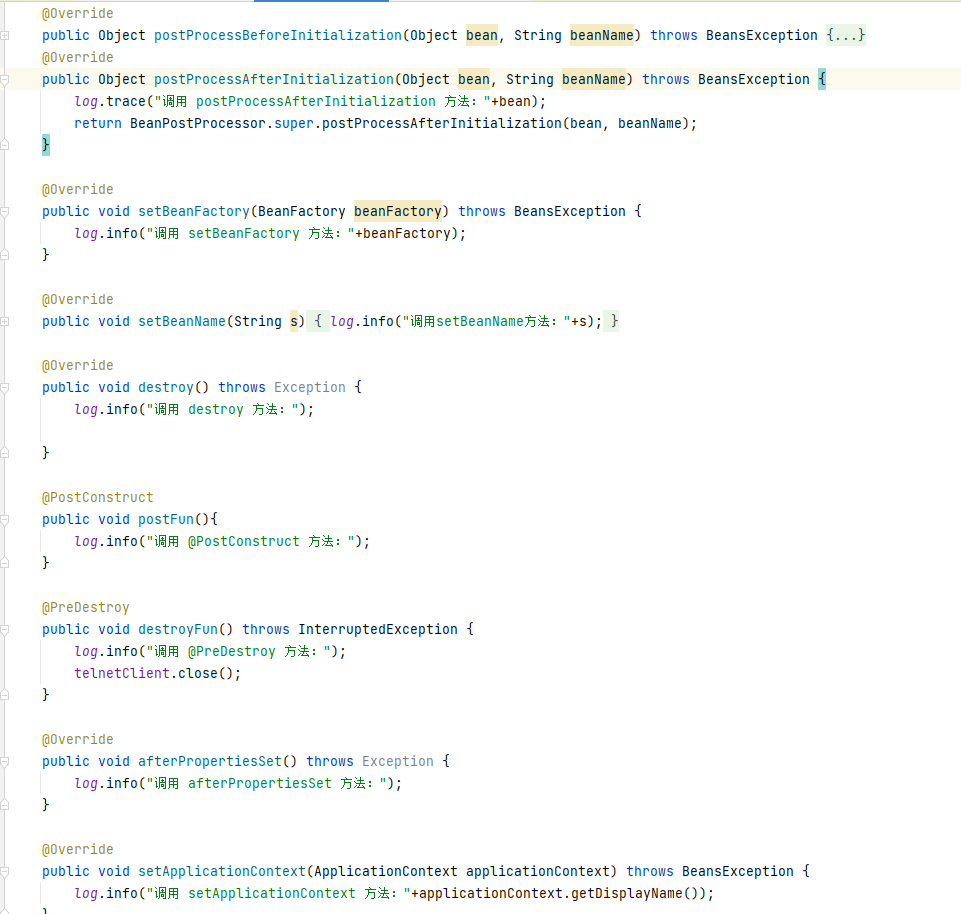

# springboot bean生命周期



# starter机制
[starter例子](https://gitee.com/shenshuxin01/first_-spring-boot_-demo/tree/master/BootAutoConfigDemo)

# SpringBoot自动配置的原理
自己看源码整理

# springboot启动流程
自己看源码

# 知识点
1. 复制一个实体类的属性到另一个实体类
`org.springframework.beans.BeanUtils.copyProperties(pojo1,pojo2);`

# 通过actuator动态配置日志级别
首先配置文件开启
```yaml
management:
  endpoints:
    web:
      exposure:
        include: 'loggers'
```
```sh
# 查询日志级别
curl http://localhost:8091/actuator/loggers/ssx.demo.specialarchlinuxprovider.controller.autorunscript.impl
#{
#     "configuredLevel": "INFO",
#     "effectiveLevel": "INFO"
# }

curl -X POST http://localhost:8091/actuator/loggers/ssx.demo.specialarchlinuxprovider \
-H "Content-Type: application/vnd.spring-boot.actuator.v2+json;charset=UTF-8" \
--data '{"configuredLevel":"info"}'
```

# 全局异常处理
```java
@ControllerAdvice(annotetions={RestCotroller.class})
public class MyBean{
  @ExceptionHandler(value={RuntimeException.class})
  public final XXX dealRun(RuntimeException e,HttpServletRequest req){
    return null;
  }
}
```