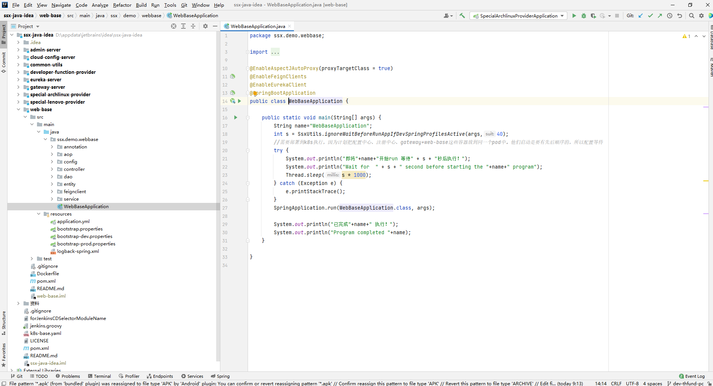

分布式框架，通过springboot一键启动的风格整合起来，简单易用，配置简单，专注业务逻辑。

# 服务注册发现
eureka（ap）、nacos（ap）、zookeeper（cp）、etcd（cp）、consul（cp）。这些都是cs架构的，cap：一致性consistency 可用性available 分区容错partition
# 远程配置中心
nacos、springCloudConfig、apollo 都是cs架构
# RPC
# 负载均衡
# 熔断

• Spring Cloud Eureka、nacos、consul、etcd、zookeeper：服务注册与发现
• Spring Cloud Zuul、gateway：服务网关
• Spring Cloud Ribbon：客户端负载均衡
• Spring Cloud Feign、dubbo、grpc：声明性的Web服务客户端
• Spring Cloud Hystrix：断路器
• Spring Cloud Config、nacos：分布式统一配置管理

# 应用2022年项目welcome-ssx
[gitee源码](https://gitee.com/shenshuxin01/ssx-java-idea)，此项目维护阶段了，截至目前2023年4月10日还在运行中，后期迁移到dubbo或者grpc

1. 基本架构：`spring cloud`
   （springBoot+服务发现+网关+负载熔断等netflex）。
   本人目前使用的是springboot+eureka+gateway+springSecurity+openfeign+springConfig+adminServer
   配合业务功能涉及中间件redis、quartz、kafka、mysql、elasticsearch
2. 日志采集处理展现：ELK
    - elasticsearch：海量json数据存储即席查询
    - logstash： 源头采集数据（tcp、file、redis、mq）、格式化处理、推送es存储
    - kibana： 官方es可视化交互curd工具
3. 高效轻量数据采集工具： filebeat。 监控日志文件实时获取，可以推送到kafka
4. kafka：接收filebeat数据，供logstash消费
5. 多服务链路追踪：sleuth-zipkin。无代码侵入。简单来说就是打印的日志内容新增了tranceId、spanId。

