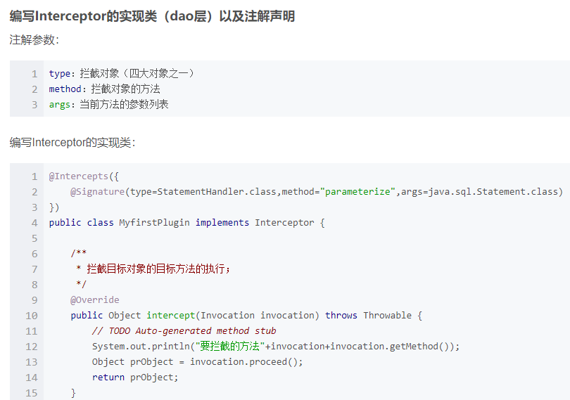
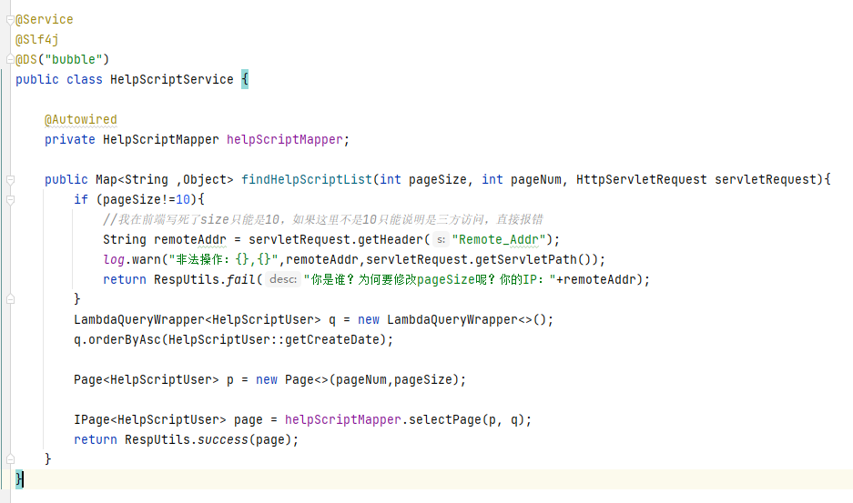

内部封装了通过JDBC访问数据库的操作，通过SQL和数据库交互。

ORM（Object/Relational Mapping）即对象关系映射，是一种数据持久化技术。它在对象模型和关系型数据库直接建立起对应关系，并且提供一种机制，通过JavaBean对象去操作数据库表的数据。 MyBatis通过简单的XML或者注解的方式进行配置和原始映射，将实体类和SQL语句之间建立映射关系，是一种半自动（之所以说是半自动，因为我们要自己写SQL）的ORM实现。

# Mybatis的一级、二级缓存
对于缓存数据更新机制，当某一个作用域(一级缓存 Session/二级缓存Namespaces)的进行了C/U/D 操作后，默认该作用域下所有 select 中的缓存将被 clear。
- 一级缓存: 基于 PerpetualCache 的 HashMap 本地缓存，其存储作用域为 Session，当 Session flush 或 close 之后，该 Session 中的所有 Cache 就将清空，默认打开一级缓存。
- 二级缓存与一级缓存其机制相同，默认也是采用 PerpetualCache，HashMap 存储，不同在于其存储作用域为 Mapper(Namespace)，并且可自定义存储源，如 Ehcache。默认不打开二级缓存，要开启二级缓存，使用二级缓存属性类需要实现Serializable序列化接口(可用来保存对象的状态),可在它的映射文件中配置 ；

# mybatis分页
- pageHelper
- 基于不同的数据库自己在sql实现，oracle使用三层rownum，mysql使用limit

# 自定义mybatis插件

# mybatis-plus使用
1. 自定义实体类 数据库映射对象
2. 创建Mapper注解接口继承 BaseMapper<实体类>。此接口有curd方法
3. 逻辑代码中操作mapper对象即可

