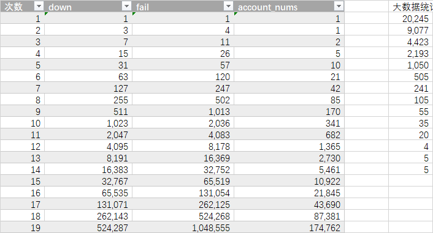

# 大盘
共73166条记录，约17个月

最终涨结果：{0=8508, 1=4263, 2=2203, 3=1170, 4=625, 5=303, 6=174, 7=65, 8=45, 9=23, 10=8, 11=12, 12=5, 13=1, 14=2, 16=1}

最终跌结果：{0=8706, 1=4239, 2=2320, 3=1163, 4=600, 5=309, 6=138, 7=72, 8=32, 9=18, 10=14, 11=5, 12=3, 13=4, 14=1, 15=1}

最终平结果：{0=24, 1=21, 2=26, 3=30, 4=25, 5=23, 6=21, 7=24, 8=29, 9=18, 10=27, 11=22, 12=19, 13=9, 14=17, 15=19, 16=16, 17=28, 
            18=15, 19=14, 20=19, 21=19, 278=1, 22=17, 23=13, 24=11, 25=14, 26=9, 27=14, 28=7, 29=10, 30=17, 31=11, 32=4, 33=6, 
            290=1, 34=7, 35=12, 36=6, 293=1, 37=5, 38=12, 39=7, 40=4, 41=7, 42=14, 43=5, 44=5, 45=7, 46=6, 47=10, 48=8, 49=6, 50=9, 
            51=9, 52=8, 53=2, 54=8, 55=5, 56=6, 57=9, 58=9, 59=4, 60=2, 61=4, 62=2, 63=5, 64=6, 65=3, 66=3, 67=3, 68=1, 69=5, 70=3, 
            71=3, 72=2, 73=5, 75=2, 76=5, 77=4, 333=1, 78=6, 81=1, 82=4, 83=5, 84=1, 85=3, 86=2, 87=3, 88=1, 89=2, 90=1, 91=6, 92=3, 
            93=3, 94=1, 95=3, 96=3, 97=2, 98=1, 99=1, 100=2, 101=4, 102=1, 103=1, 104=1, 105=1, 106=2, 107=2, 108=1, 111=2, 112=2, 
            113=1, 114=1, 115=1, 118=1, 119=1, 120=1, 121=1, 122=1, 123=2, 124=1, 125=2, 126=2, 127=2, 130=1, 132=1, 134=3, 135=2, 
            136=1, 138=2, 141=1, 144=2, 149=2, 150=1, 151=1, 154=1, 158=2, 159=2, 160=2, 164=1, 169=1, 183=1, 191=1, 213=1}

如果最大连续投9次，那么就是每天收益：27166*2.2/365=163.740274

# 期货

