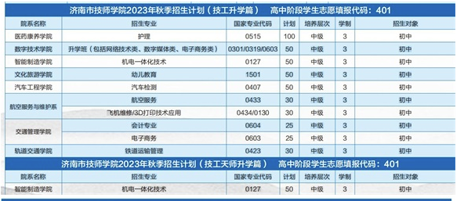

 

---

# 1. 济南信息工程学校
地址：济南市历城区王舍人镇朝山街316号 
http://jnxxgc.jinan.cn/art/2023/5/22/art_202_296943.html

qq群联系了老师，分数低录取希望小

# 2. 济南电子机械工程学校
地址：济南市高新区奥体中路3888号 
http://jndz.jinan.cn/

联系了侯哥，分数太低，分数400左右可以报名
第三次志愿填报

# 3. 山东省济南商贸学校
地址：济南市工业南路32号
http://smxx.jndjg.cn/

## 优先报名此
1. 0531-59617888招生老师说可以填报（https://czxk.jnzk.net），学校代码146，等录取结果,不一定会录取，等到7月7号填报，等结果。如果录取了就上这个学校

# 4. 山东省冶金中等专业学校
地址：济南市历城区工业北路9108号
http://www.yjxy.net/

联系了侯哥，分数太低，分数400左右可以报名

# 5. 济南铁路学校（二仙济南技师学院）
http://www.cnsdjxw.com/school_brows.asp?id=4607
济南铁路学校电话：
0531-66772211

注：三二连读计划，前三年注册济南铁路学校中专学籍，免学费；后两年注册济南工程职业技术学院高职大专学籍，根据公办院校收费标准收学费。五年全部在学校组织教学，第三年经转段考试合格方可注册济南工程职业技术学院学籍，修满相应专业教学计划规定的全部课程，成绩合格，准予毕业，颁发普通高等学校 全日制专科毕业证书。

## 济南市技师学院（离家近）招生咨询方式： 预备技师 高级技工 中级技工
联系电话：400-619-8866（一键拨打号码）
1. 2023年7月4日联系了招生老师199 5313 8248李老师，咨询计算机专业，现在可以先报技工升学班（在学校网站里填写报名），免学费，学3年，是中级技工证，然后参加职教高考，考大学

2. 等到7月16在2023年济南市高中阶段学校招生填报志愿，填报（https://czxk.jnzk.net），填报第二批次，报考【济南铁路学校，代码233】（就是二仙济南技师，一个学校两个名字），免学费，如果录取了，学3年，就是中专毕业，然后参加职教高考，考大学

# 6. 齐河技工学校
刚刚电话联系了，老师说分数不够，建议联系历城区学校问一下

# 7. 济南理工学校
电话联系不通

# 8. 模拟网上报名 
https://czxk.jnzk.net/
- 身份证： 370112200806110438
- 学籍号： 2020370115090120224
- 登录修改密码： 12345a
- 商贸职业学校（代码146）
- 12125456 (此确认码在后期填报志愿阶段使用，填报、修改志愿需填写此确认码。请妥善保管!)

2023年7月5日第二次模拟报名，此时登录后修改的密码就是后续正式报名的密码12345a

# 综上，报名
打算给他报名【山东省济南商贸学校】 ，我联系那边老师说等到7号报名，等结果。如果考不上就上【济南市技师学院】二仙这个，我打电话问过了，可以报升学班，三年后是中专证，然后参加职教高考，考大学

# 录取结果
1. 2023年高中阶段学校招生第一批次志愿录取信息将于7月14日15:00公布。考生可登录“济南市高中阶段学校招生录取平台”（czxk.jnzk.net）或通过“爱山东”APP、济南市教育局微信公众号查询录取结果。查询时间为7月14日15:00至15日17:00。

第二批次志愿填报时间为7月16日至7月17日，每天8:00至17:00进行。

第二批次志愿录取时间为7月18日至7月21日。

