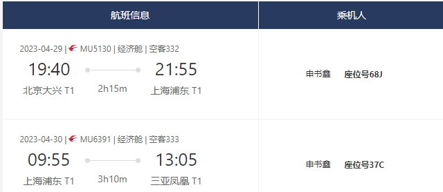
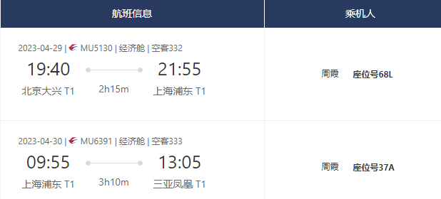
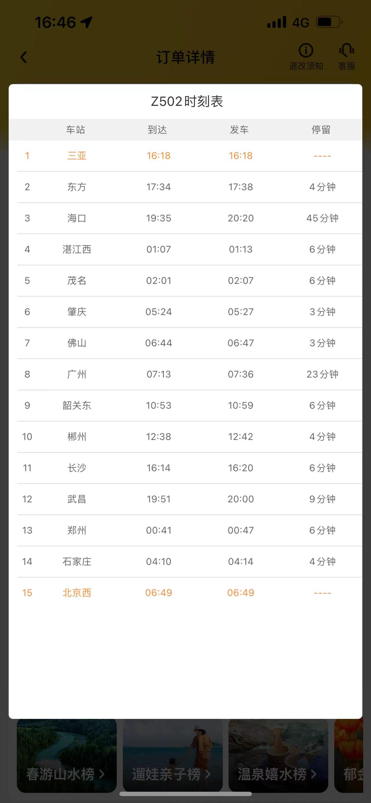

# 出发信息
  

# 第一天
住宿：三亚湾旁边的万隆花园

     <iframe width="500" height="400" frameborder="0" src="https://cn.bing.com/maps/embed?h=400&w=500&cp=m1gmr2t3k14z&lvl=15&typ=d&sty=r&src=SHELL&FORM=MBEDV8" scrolling="no">
     </iframe>
     

        <a id="largeMapLink" target="_blank" href="https://cn.bing.com/maps?cp=m1gmr2t3k14z&amp;sty=r&amp;lvl=15&amp;FORM=MBEDLD">查看放大的地图</a> &nbsp; | &nbsp;
        <a id="dirMapLink" target="_blank" href="https://cn.bing.com/maps/directions?cp=m1gmr2t3k14z&amp;sty=r&amp;lvl=15&amp;rtp=~pos.m1gmr2_t3k14z____&amp;FORM=MBEDLD">获取路线</a>
    

下午去三亚湾 海虹广场

# 第二天
耶梦长廊的沙滩看日落
亿恒夜市买了防晒帽 泳裤

# 第三天
西岛 包含往返的船票

# 第四天
上午在三亚湾沙滩
下午三亚火车站返程

