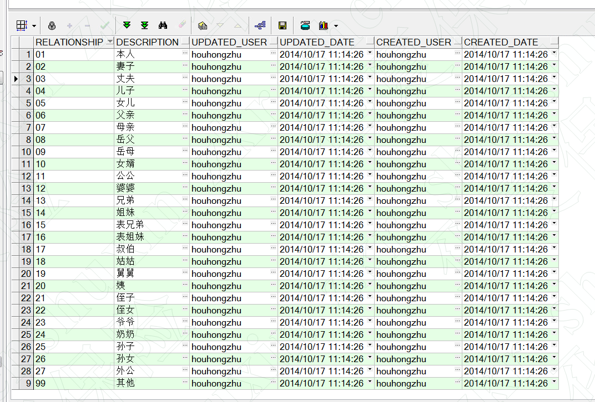
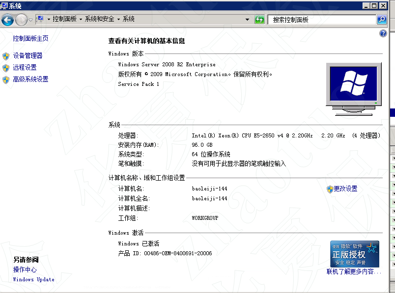

个险：个险就是咱们通常说的代理人渠道，保险公司自己招聘的。保险代理人，是指根据保险人的委托授权，代理其经营保险业务，并收取代理费用的人。保险代理人在保险人授权的范围内以保险人的名义进行业务活动，包括招揽业务的宣传推销活动，接受投保，出立暂保单或保险单，代收保险费

银保也是一个销售渠道，保险公司会给一部分产品到银行

关于保险产品的销售，有很多种
主要有以下6种渠道：
保险代理人
银行保险渠道
团体保险渠道
经纪代理渠道
电话销售渠道
互联网保险

https://www.zhihu.com/question/320462528

华夏保险公司员工内勤：不去实际卖保险出单，负责公司管理相关
		    外勤：通过卖保险挣钱

## 银保
1. 银保：保险产品销售的一种方式，在银行网点销售保险的方式
2. 销售方式：带网：在银行网点出单的保单
3. 销售方式：直营：不通过银行出单的保单，但是此保单属于银保系统
4. 同比：2021年5月和2020年5月比
5. 环比：2021年5月和2021年4月比
6. 总公司、分公司、中支、三级机构、区部组都是什么
	总公司—— 一级机构 
	分公司——　二级机构 
	中心支公司——　三级机构
	一般来说省会城市的保险公司叫分公司，下面地级市的叫中心支公司。县城通常叫县支公司，再下面的部门就叫营业部了

---
## 银保督导小龙人项目相关
1. 带网、直营的概念
	带网是在银行出单的
2. 保单信息中 管理机构、中支、区、部、处的概念

## SCRM家庭图谱
1.短险超市保单，投保人被保人之间关系是00，此关系在码表查不到。

## 银保续期项目
时间：2021年4月27日 
医保通转保换保需求变更 

### 银保银保转保需求分析： 
1. 微信聊天记录 
    - 3-29	医保通转保换保需求变更V5.docx
    - 4-8	报表改造0406.rar
    - 4-8	CRM系统续期需求0407(1).docx 
    - 4-13	续期系统销管需求.docx
    - 4-14	CRM系统续期需求0407(2)(1).docx
    - 4-22	存储过程详细说明：续期达成报表  ETL_FACT_YB_XQ_LIST.sql	
        存储过程详细说明：应收状态清单  ETL_FACT_YB_YS_LIST.sql
    - 5-20	最新需求文档："D:\Program Files (x86)\WeChat\WeChat Files\wxid_mmogxjwsyh0a22\FileStorage\File\2021-05\附件3：用户需求说明书.docx"
2. 如果是客户经理页面显示个人的月度续期收费率和季度续期收费率，如果是部经理职级显示的个人和团队的月度续期收费率和季度续期收费率.
以及vdi-飞秋 
根据以上内容整理出自己要开发的部分：
修改两个报表调整-修改存过：应收清单+续期达成
手机端增加两个字段：个人、团队收费率
自己写的笔记
3. 其他补充
“医保通”最直接的优势就是明显缩短了客户理赔的环节，很大程度上解决了“理赔难”的问题。传统上，住院客户必须在治疗结束出院时先行支付全部医疗费用，然后再向保险公司报案，提交完整资料，待审批通过后，才能从保险公司获取保险理赔款。而“医保通”把这个过程限制和压缩在客户住院期间，客户出院时保险公司理赔的主要工作已经完成，客户办理出院手续即可获得理赔，大大节省了客户办理理赔的时间，免去了往返奔波的辛苦。对于医疗机构来说，由于提供了独特、新型的服务，可以吸引到更多的病人上门就诊，共享保险公司庞大的客户资源。

4. 转保是指放弃之前投保的保险公司，而转入另外一家保险公司。转保分为车险转保、保单转保这两大模块，具体介绍如下：
    - 一、车险转保
 1、尽量等车险到期后再转保
 许多车主会在车险到期前选择转保，这种情况有很大的弊端。虽然在老车险到期前和新车险生效后的特殊时期内，车主相当于享受了两份车险。但是如果出事故不一定会得到双份赔偿，也会有非常繁琐的手续，所以不建议车险到期前转保。
 2、转保费用与上一年度出现次数有关
 如果车主上一年度出险次数多，保险行业从自身盈利的角度出发，很可能拒绝转保客户，并且转保费用也会相应提高。
    - 二、保单转保
 保单转保就是从A保险公司购买的保单转到B保险公司进行投保，通常保险公司不提供保单转保服务，只提供加保相关服务。但是保单转保有很大优点：
 1、保单转保可以变更内容信息，包括投保人变更、被保险人相关信息变更、受益人变更、续期保费形式的变更、职业类别的变更、缴费方式变更。
 2、转保风险较小。投保人选择退保不仅会承担较大的退保损失，而且退保后再购买保险，保险公司将以购买时的年龄作为新的投保年龄；而转保就可以避免这一问题，使新保单的投保年龄与原保单相同。
 3、手续较为简单。退保后再购买保险，保险公司需要重新核保，投保人面临被拒保和增加保费的风险。转保时保险公司一般不会进行二次核保，相关信息会按照投保人初次投保时的核保等级来进行费率的计算。
                 
5. 什么是宽限期60天？就是到了该交保费的日子，你没交钱。没关系，保险公司不会废止合同，而是免费送你一段保障时间，通常是60天。在宽限期内，交了保费，保障仍然继续。如果过了宽限期，仍然不交钱，保障才会失效。
换保：概念模糊：把现有的保单退掉，买新的保单。
一般来说省会城市的保险公司叫分公司，下面地级市的叫中心支公司（中支）。县城通常叫县支公司，再下面的部门就叫营业部
保险人、承保人：代表保险公司

6. 续保：续保是保险合同即将期满时，被保险人向保险人提出申请，要求延长该保险合同的期限或重新办理保险手续的行为。在办理续保手续时，保险人或被保险人都可以根据当时的客观情况或需要，适当增加或减少保险金额，或做其他变动。续保的方式有三种： ①另订新的保险合同; ②按原条件订立 “续保证明书”; ③将收取续保费的 “续保收据” 作为续保的凭证，一切条件按原保单。我国保险业务的续保工作，一般由保险公司于原保险合同期满前通知被保险人， 根据当时投保财产情况和需求，重新订立保险合同。
预警单：预警明细（还有××天保单失效、还有××天就过了60天宽限期）
同一张保单下可以存在两个或多个不同的险种，统计口径按险种分类，一条记录为一个险种，一张保单可能存在多条记录。
LASS：全称（Limra Agent Selection System），是美国寿险行销调研协会（LIMRA）一个关于保险代理人的甄选系统。

### 2021年5月6日-----问题：
1.如何判断客户职级？有没有职级码表？ （部经理是GC1） 

2.保费应收月二次保费、三次保费、宽一月二次保费、宽一月三次保费、宽末月？？概念是什么意思

4.客户经理个人月度续期收费率计算：
    宽末月实收续期长期交保费（二次及以上合计）/宽末月应收续期长期交保费（二次及以上合计）
    客户经理个人季度续期收费率计算：
    统计季度三个月，其中每个月只统计宽末月续期长期交保费数据
    
5.统计结果的百分比，是四舍五入的保留两位小数吗？例 81.34%

6.按季度统计的是当前季度三个月吗？
    例子：本月是2月，那么季度统计的就只有1、2月的数据，没有3月的数据。

7.续期达成报表查询前端页面什么样子的，存过ETL_FACT_YB_XQ_LIST的参数的作用是指定查询某个月的数剧吗？

因为需求变化，以上问题忽略

# 生产数据库实例信息
此配置可以实现千万级表之间连接，可以同时表连接3张处理，大概30分钟执行时间

