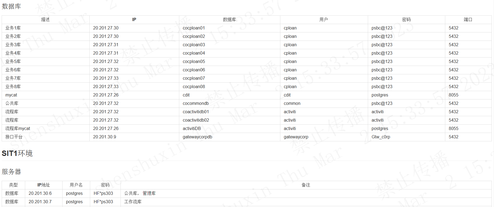
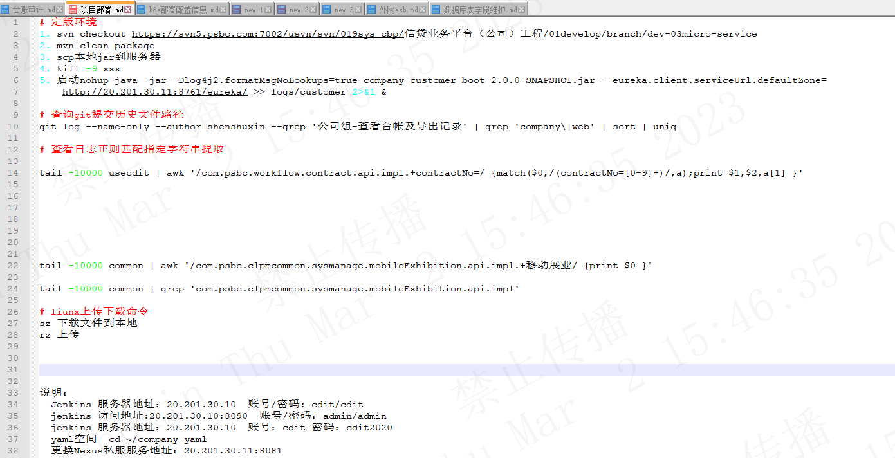
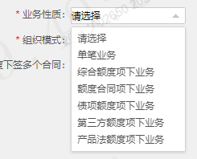
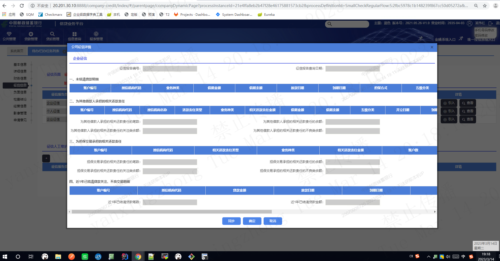

# 工作时间202204-202303
## 1. 架构相关

## 2. 开发工作

### 2.1 devOpsJenkins

### 2.2 工作流activiti相关

### 2.3 查询k8s的服务日志

# 3. 工作内容

1. 信贷对公平台是2020年上线的，我是22年入职，处于项目快速更新迭代时期（敏捷开发），每个月都会上线一些新功能。整个项目大约200人。分为：
	- 架构组
	- 开发组
	- 测试组
	- 需求组
	- 后勤助理

2. 项目使用jira管理工具，具体一个需求称为【故事】，故事首先由需求组创建，流转给开发组进行开发，然后流转给测试组测试，最终故事完结上线

3. 前端使用的是angularJs，后台是spring cloud netflix 开发主要是工作审批流框架activiti
  - 例如一个辞职审批流程一共需3步，本人发起申请，流程提交到组长名下，组长同意后流程提交到项目经理进行终审。
  - 在acitiviti画出这三步流程：
  - 每一步都可以设置展示的**页面**、流程下一步点击时候调用后台自定义**下一步处理类**，或者流程撤销点击时候调用后台自定义**撤销处理类**
  - 流程图例子

  - 页面例子
  
  - 后台业务处理类
  

# 业务流程逻辑
平台主页面

待办已办任务列表

## 业务申请
业务员选择一个客户，跳转到业务申请发起页面，需要选择
- 业务申请类型（小微易贷，法人账户透支业务，委托贷款、银团业务等）
- 融资模式（小企业、一般企业）
- 贷款用途（医疗、教育、建设等）
- 是否可循环额度

发起之后跳转到审批流程页面，客户经理需要填写批复金额（借多少钱）、批复开始日期，结束日期，担保方式-抵质押、信用贷款。
业务统计信息：是否绿色信贷（碳排放、二氧化碳排放、污水、噪音等指标是否正常），是否符合2020版人行信贷、是否符合银保监会信贷
征信信息：五级分类（关注正常次级可疑损失）、近一年已结清贷款金额、笔数、未结清贷款笔数、金额。等
共同借款人、审批意见决策通知单

## 合同申请
填写一些借款周期、借款金额、

## 支用申请
填写

## 还款申请

提前还款

## 贷后检查
小企业贷后检查

	 